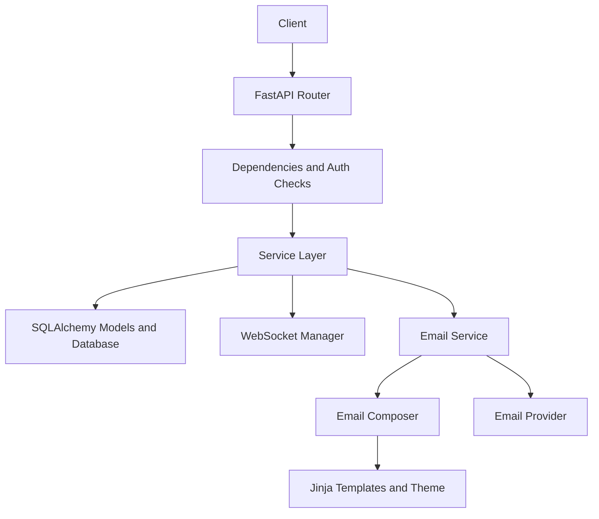

# Features

This file is the implementation-facing inventory of what the SDK currently
supports. Update it whenever a feature is added, removed, or materially
changed.

## Feature inventory

### Application shell

- `MessagingApp` bootstraps middleware, routers, static uploads, and database startup hooks
- CORS validation rejects wildcard origins outside development
- Session middleware is included for OAuth support

### Authentication

- Local registration and login with JWT access and refresh tokens
- Authenticated current-user lookup
- Email verification with replay protection
- Password reset with replay protection and password-state binding
- Basic in-memory rate limiting on auth-sensitive endpoints
- Google OAuth web flow
- Google mobile callback and short-lived code exchange flow

### Email system

- Transport-agnostic email composition layer
- Built-in Jinja templates for verification and password reset emails
- Theme-based branding values
- File-based template overrides through `EMAIL_TEMPLATE_DIR`
- Programmatic hooks through `EmailCustomization`
- Custom link builders for per-email destinations
- Console, Resend, SendGrid, and SMTP provider support

### Profiles

- Get current profile
- Update full name and bio
- Change password
- Upload profile picture with server-side file type validation
- View a public profile
- Delete account with password confirmation

### Contacts

- Send contact request
- Accept or reject request
- Remove contact
- Block user
- Relationship checks used by messaging rules

### Messaging

- Create direct conversations between accepted contacts
- Create group chats
- Add or remove group members
- Promote or demote group admins
- Toggle admin-only add-member setting
- Send, edit, and soft-delete messages
- Read tracking and unread count support
- Real-time typing and message events over WebSocket
- Membership enforcement for conversation reads and writes

### Calling

- Initiate 1-on-1 and group voice/video calls
- Answer, decline, and end calls
- Invite new participants to active group calls
- Update participant media state
- Get active calls and call history
- Signaling membership validation for WebSocket events

### Search

- User search
- Message search
- Conversation search
- Global search aggregator
- PostgreSQL-specific text search and similarity behavior

### Tooling

- Installable package metadata and packaged email template assets
- CLI scaffold generation
- CLI config summary
- CLI migration helper
- Static documentation website with copyable snippets
- Pytest suite for the current implemented surface
- GitHub Actions CI and release drafting

## Implementation schema

### High-level module map

```text
MessagingApp
|
+-- core/
|   +-- config.py           -> environment and runtime settings
|   +-- security.py         -> JWTs, password hashing, token helpers
|   +-- dependencies.py     -> auth and request dependencies
|   +-- transient_store.py  -> in-memory rate limits and one-time token state
|
+-- api/v1/
|   +-- auth.py             -> registration, login, verification, reset, OAuth
|   +-- profile.py          -> profile and uploads
|   +-- contacts.py         -> contact lifecycle
|   +-- chat.py             -> conversation and message APIs + messaging WebSocket
|   +-- calls.py            -> call lifecycle APIs
|   +-- search.py           -> search endpoints
|   +-- websocket_signaling.py -> WebRTC signaling WebSocket
|
+-- services/
|   +-- user_service.py
|   +-- contact_service.py
|   +-- chat_service.py
|   +-- call_service.py
|   +-- search_service.py
|   +-- profile_service.py
|   +-- oauth_service.py
|   +-- email_service.py
|
+-- models/
|   +-- user.py
|   +-- contact.py
|   +-- message.py
|   +-- call.py
|
+-- emailing.py            -> email composer, theme, hooks, template runtime
+-- providers/email.py     -> delivery transports only
+-- websocket/manager.py   -> connection fanout helpers
```

### Request flow schema



### Messaging schema

```text
Conversation
|- is_group
|- participants: ConversationParticipant[]
|- messages: Message[]

ConversationParticipant
|- user_id
|- is_admin
|- last_read_message_id

Message
|- sender_id
|- content
|- message_type
|- is_edited
|- is_deleted
```

### Calling schema

```text
Call
|- initiator_id
|- call_type
|- call_mode
|- status
|- participants: CallParticipant[]
|- invitations: CallInvitation[]

CallParticipant
|- user_id
|- role
|- status
|- is_muted
|- is_video_enabled
|- is_screen_sharing
```

## Feature handling notes

### Email customization

- Default templates live under `messaging_sdk/email_templates/`
- Scaffolded apps get editable copies under `app/email_templates/`
- Runtime overrides can be passed through `EmailCustomization`
- Link changes belong in `link_builders`, not in providers

### Messaging rules

- Direct conversations require accepted contacts
- Conversation membership is enforced in service-layer reads and writes
- Group moderation behavior is controlled by participant admin flags and group settings

### Calling rules

- Signaling access is validated against persisted call participation
- Group call invitations create participant and invitation records separately

### Search rules

- Search should be treated as PostgreSQL-only until a database-agnostic strategy exists
- Public user search results should not expose private email data

## Documentation maintenance rule

Whenever you ship a feature change:

- update this file if the capability inventory or architecture changed
- update `README.md` if setup, usage, or extension points changed
- update `SECURITY.md` if the risk profile changed
- update `CHANGELOG.md` if the change is release-visible
